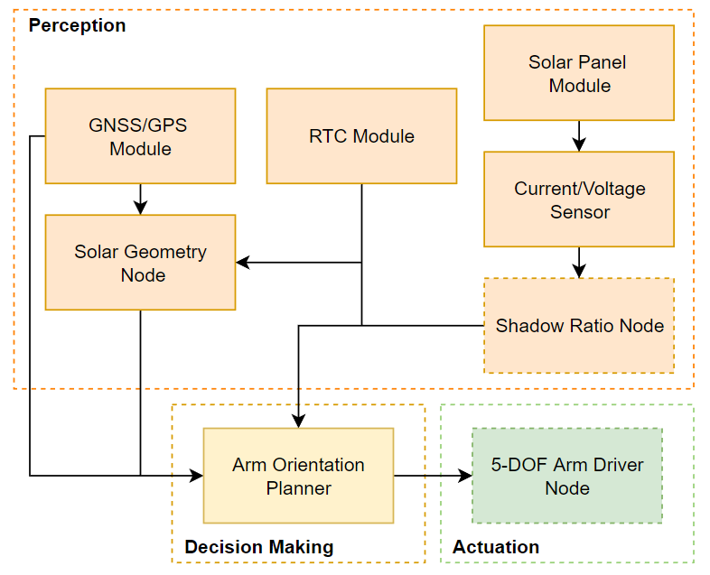
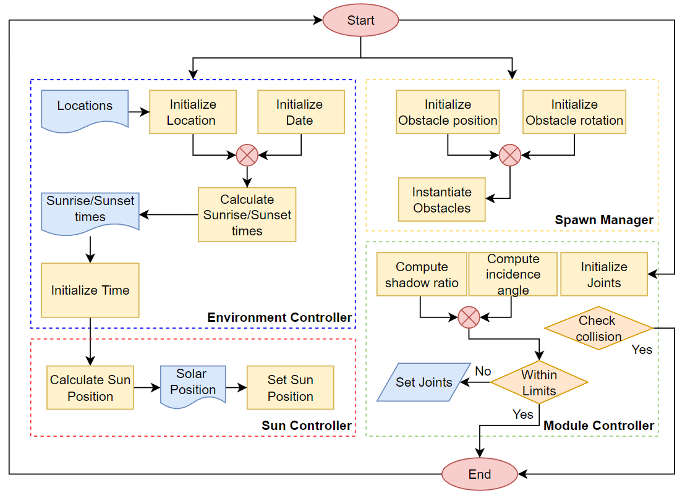
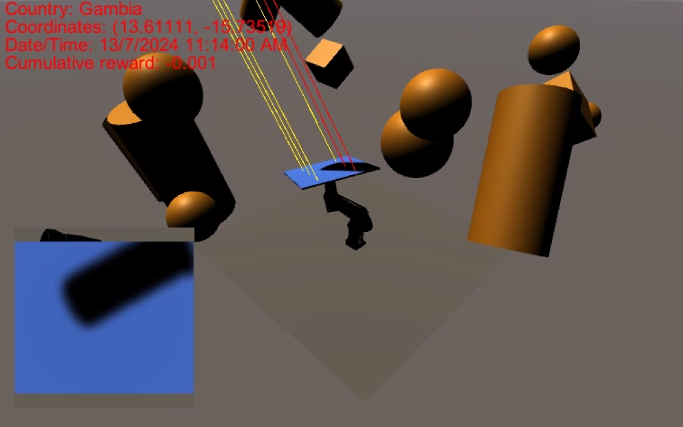

# Adaptive Solar Tree

## Abstract
Modern solar panel systems have achieved full solar
tracking capabilities but lacks the ability to handle power loss
due to shadowing. In this work, we present a novel and intuitive
method of increasing solar outputs by leveraging reinforcement
learning and a 5-DOF robotic arm manipulator design. We utilized in-game cameras to emulate shadow ratios of solar modules
derived from current-voltage sensor readings. The reinforcement
agent was trained in a simulated environment equipped with
geographically-accurate sun positioning and shadow casting using
ray-tracing. Our approach showed promising results in simplifying and integrating solar tracking and shadow detection.
[Publication link](Misc/Adaptive_Solar_Tree_A00229978A_AHMEDSYALABISEET.pdf)

## System Architecture

## Episodic flow

## Environment
Simulation environment was coded in C# using Unity 3D game engine.
### Observation space (15 elements)
- Location's latitude and longitude (2 states, float)
- Solar altitude and azimuth (2 states, float)
- Shadow ratio per module (6 states, float)
- Current motor angles in degrees (5 states, float)
### Action space
- Target angle of all motors in degrees (5 continuous values)
### Rewards
- +1 when all solar panels are within
    - incidence angle limit < 15 degrees
    - shadow ratio limit < 0.1
- -1 when collision occurs
- -0.001 for every time step
### Episode length 
- 3000 steps

