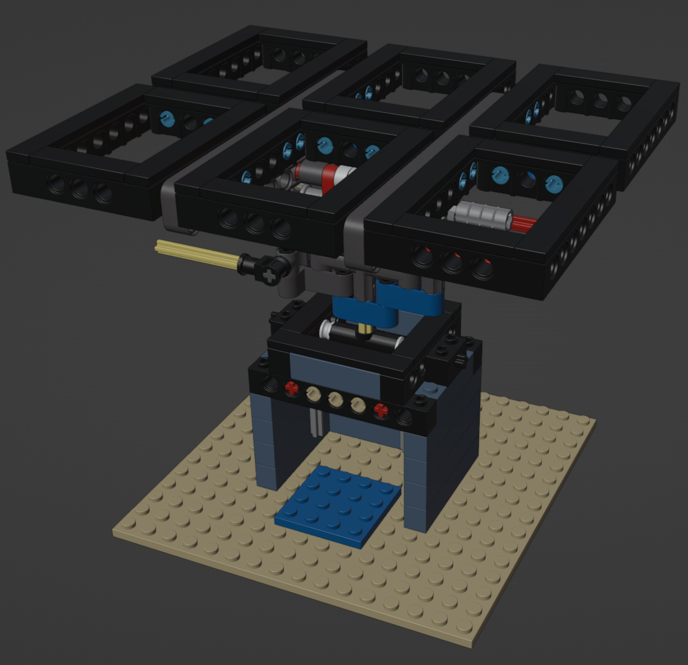
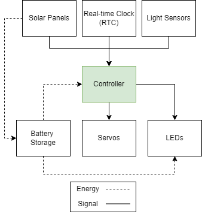

# Adaptive Solar Tree

The purpose of this project is to build an adaptive solar panel robotic system that is able to autonomously veer away from shadows and orient itself perpendicularly to the sun to maximize power efficiency.

## Progress
- [X] Design branch module
- [ ] Build physical branch module
- [X] Design physical computing system
- [ ] Build physical computing system
- [ ] Build 3D environment using Unity
- [ ] Train PPO agent using ML-Agents library
- [ ] Quantize and port trained ONNX model to Tensorflow-Lite
- [ ] Build microcontroller inference script for Raspberry Pi PICO

## Environment
### Observation space
- Light sensor outputs (shadow state)
- Elevation/Zenith angle of observer (sun position)
- Azimuth angle of observer (sun position)
- Tilt angle of observer (panel position)
- Relative cardinal positions of all prismatic joints (limb position)
- Relative angular positions of all revolute joints (limb position)
### Action space
- Target rotation of all stepper motors in radians (continuous action)
- Deep sleep parameter in hours
### Rewards
- +1 for every step when all light sensor states are 1 and incident angles are approximately perpendicular to the sun
- -0.00005 for every incremental angle to move motors

Environment scripts will be coded in C# in Unity.

## Orientation mechanism
A set of 4 stepper motors will be used for the mechanism. For rapid and cheap prototyping, LEGO parts will be used to interface with the motors. Stepper motors were used for its detent torque when powered off to retain its position unlike servo motors. The mechanism will consist of 2 revolute joints and 1 prismatic joint.

The angle position values of the motors will have to be saved in flash memory during deep sleep.

## Physical computing
To further maximize power efficiency, a light-weight Raspberry Pi PICO microcontroller will be used for its physical computing. Deep sleep or dormant mode will be engaged in between periods of compute, reducing power consumptions up to 99% at 0.8mA. 

The deep sleep parameter will be inferred dynamically by the agent and inputted at the end of every compute.

Light sensors will be attached around the solar panels for shadow detection.

Microcontroller scripts will be coded in C++ utilizing Tensorflow Lite API and Raspberry Pi PICO SDK.

## Reinforcement Agent
The training scripts will be coded in Python using mlagents_env and gym libraries.

## References
- NREL's Solar Position Algorithm (SPA)